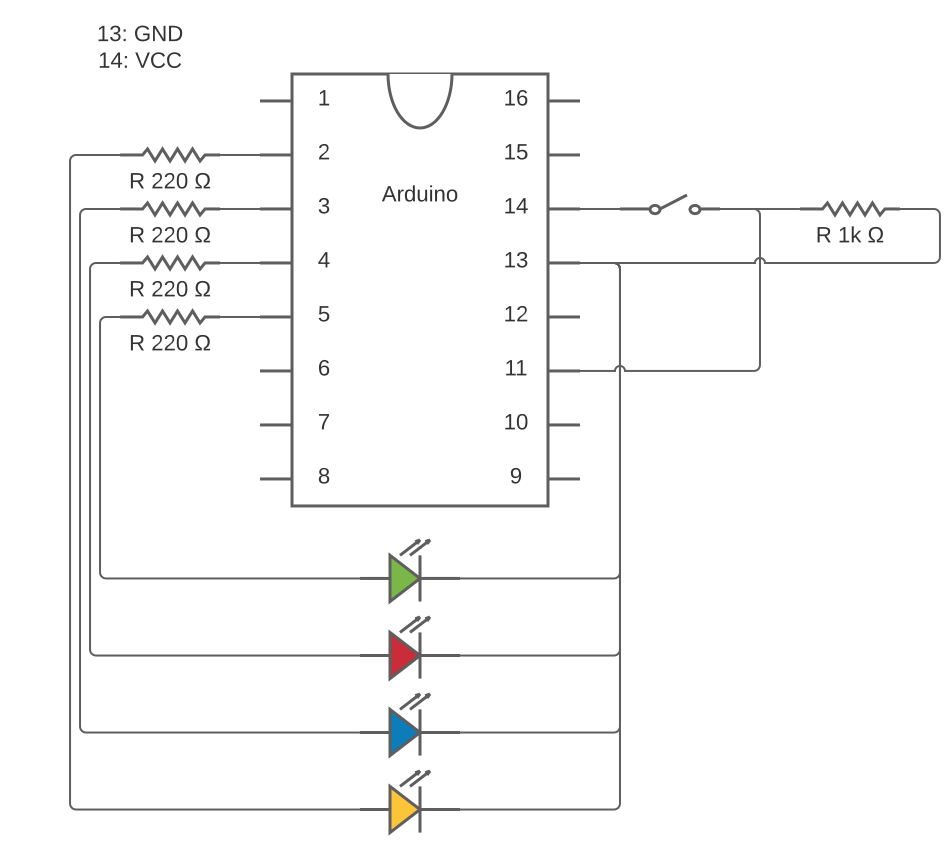

# 1st Lab work: Building an embedded system

| Group     | 1                     |
| --------- | --------------------- |
| Student 1 | 89470 - João Coutinho |
| Student 2 | 89472 - João Porto    |

## Design the interface:
### Calculate the values of resistors associated with the LEDs:

$$max\_i = 40\ mA,\ i = 15\ mA$$
$$v = Power - VoltageDrop$$
$$R=\frac{v}{i}$$

**R_red**: 

$VoltageDrop = 1.89\ V$

$v = 5 - 1.89 = 3.11\ V$

$R = \frac{3.11}{0.015} = 207.33\ \Omega$

**R_green**:

$VoltageDrop = 2.07\ V$

$v = 5 - 2.07 = 2.93\ V$

$R = \frac{2.93}{0.015} = 195.33\ \Omega$

**R_blue**:

$VoltageDrop = 2.94\ V$

$v = 5 - 2.94 = 2.06\ V$

$R = \frac{2.06}{0.015} = 137.33\ \Omega$

**R_yellow**:

$VoltageDrop = 2.01\ V$

$v = 5 - 2.01 = 2.99\ V$

$R = \frac{2.99}{0.015} = 199.33\ \Omega$

### Draw and design the press button interface to the controller:


### Measure the voltage drops on the LEDs:

**V_red**: 1.89 V

**V_green**: 2.07 V

**V_blue**: 2.94 V

**V_yellow**: 2.01 V

### Estimate the power consumption of the interface (the circuit with the resistors and LEDs in the figure) in normal operation:

$$v = R \times i \Leftrightarrow i = \frac{v}{R}$$
$$p = v \times i = \frac{v^2}{R}$$

**When red LED is lit:**

$v = 3.11\ V,\ R = 220\ \Omega$

$p = \frac{3.11^2}{220} = 0.04396\ W = 43.96\ mW$

**When green led is lit:**

$v = 2.93\ v,\ R = 220\ \Omega$

$p = \frac{2.93^2}{220} = 0.03902\ W = 39.02\ mW$

**When blue led is lit:**

$v = 2.06\ v,\ R = 220\ \Omega$

$p = \frac{2.06^2}{220} = 0.01929\ W = 19.29\ mW$

**When yellow led is lit:**

$v = 2.99\ v,\ R = 220\ \Omega$

$p = \frac{2.99^2}{220} = 0.04064\ W = 40.64\ mW$

**Max consumption:** $43.96\ mW$,
**Average consumption:** $\frac{43.96+39.02+19.29+40.64}{5} = \frac{142.91}{5} = 28.58\ mW$

## Program the application:
### Add your program listing (adequately structured and commented):
```c
const int GREEN = 5;
const int RED = 4;
const int BLUE = 3;
const int YELLOW = 2;
const int BUTTON = 11;

void setup() {
  pinMode(GREEN, OUTPUT);
  pinMode(RED, OUTPUT);
  pinMode(BLUE, OUTPUT);
  pinMode(YELLOW, OUTPUT);
  pinMode(BUTTON, INPUT);
  pinMode(LED_BUILTIN, OUTPUT); // use builtin LED as paused indicator

  digitalWrite(GREEN, LOW); // turn the LED off (LOW is the voltage level)
  digitalWrite(RED, LOW); // turn the LED off (LOW is the voltage level)
  digitalWrite(BLUE, LOW); // turn the LED off (LOW is the voltage level)
  digitalWrite(YELLOW, LOW); // turn the LED off (LOW is the voltage level)
}

void loop() {
  // 1st
  blink(RED, 1000);

  // 2nd
  blink(GREEN, 1000);

  // 3rd
  blink(BLUE, 1000);

  // 4th
  blink(YELLOW, 1000);

  // 5th
  wait(1000); // wait 1000ms
}

// Function to blink the LED
void blink(int led, int duration) {
  digitalWrite(led, HIGH); // turn the LED on (HIGH is the voltage level)
  wait(duration); // wait 1000ms
  digitalWrite(led, LOW); // turn the LED off by making the voltage low
}

// Our interpretation of the guide is that the system remains paused between button presses
// and not while the button is pressed
void wait(int duration) {
  unsigned int current_time = millis();
  bool paused = false;

  while (millis() - current_time < duration) {
  
  	// Toggle paused state when button is pressed
    if (digitalRead(BUTTON) == HIGH) {
      paused = !paused;
      duration -= millis() - current_time; // Deduct already elapsed time from duration
      delay(500); // Buffer wait to allow button to depress
    }
	
	// Freeze time when state is paused
    if (paused) {
      digitalWrite(LED_BUILTIN, HIGH);
      current_time = millis();
    } else {
      digitalWrite(LED_BUILTIN, LOW);
    }
  }
}
```
