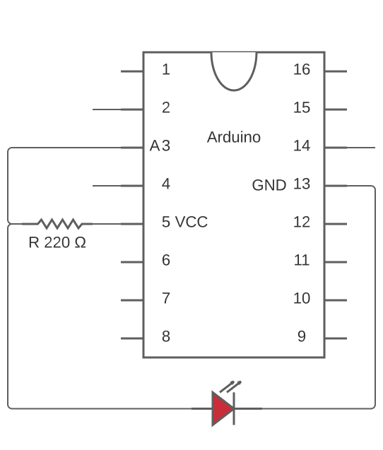
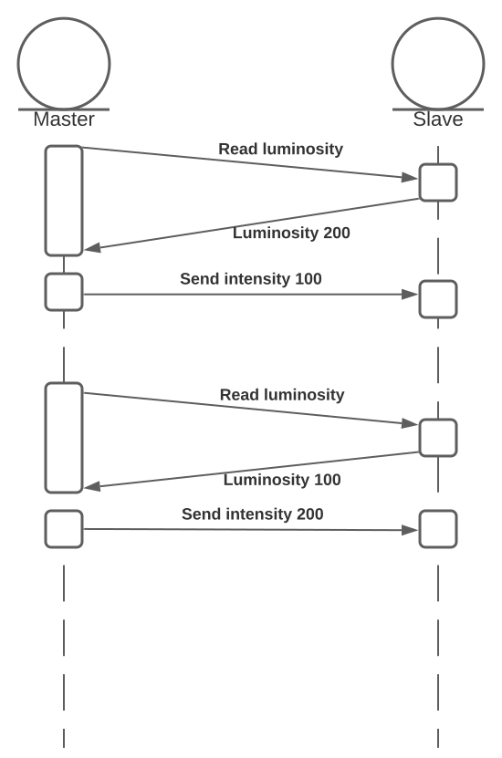

# 2nd Lab work:  Network of Sensors and Actuators

| Group     | 1                     |
| --------- | --------------------- |
| Student 1 | 89470 - João Coutinho |
| Student 2 | 89472 - João Porto    |

## 1. Describe the structure of the programs developed for both controllers
### a. Describe the design pattern (such as tasks/modules in the round-robin loop)

**Master**: The master controller uses a round-robin architecture. First, it reads the room luminosity from the light sensor and maps it to a value from 0 to 255. Then, it reads the angle of the potentiometer and also maps it to a value from 0 to 255. Finally, it reads the room temperature from the corresponding sensor and uses a Schmitt trigger to map to a boolean value of 0 or 1. After reading all the sensors the results are sent to the I2C bus in the following order: light, potentiometer, temperature.

**Slave**: The slave controller uses a round-robin with interrupts architecture. In its main loop, it handles each of the LEDs using global variables to determine light intensity for red LED, blinking period for yellow LED and whether or not to light the blue LED, in this order. These global variables are written in the interrupt function, which is called when the I2C bus is ready to be read. It reads the room light intensity and calculates the LED intensity, reads the potentiometer angle and maps to a value from 200 to 2000 (period limits) and reads the boolean value for whether or not the room is above the predetermined temperature.

### b. Describe other implementation issues (such as implementation of tasks) you consider relevant for the overall app 

For the communication aspect of the application, we decided that all values should be written to and read from the I2C bus as chars in order to guarantee that each of them only takes one byte of bandwith.

The potentiometer provided in the starter kit was not making good contact with the breadboard so instead we used another potentiometer that was laying around in the workshop.

The mapping of the temperature sensor values to actual temperatures is achieved through a single call to the `map` function. The math that derived the values used in that call is explained later on.

## 2. Controller #1 program - I2C master

## 3. Controller #2 program - I2C slave

## 4. For each of the three pairs of sensor-actuator describe:
### a. the mapping process implemented
**Luminosity sensor**: Controls intensity of red LED

**Potentiometer**: Controls blinking period of yellow LED

**Temperature sensor**: Controls whether or not blue LED lights up

### b. the calibration process
All values read directly from the sensor are in a 0 to 1023 range.

**Luminosity sensor**: The sensor value is mapped to a 0 to 255 range so it can be sent over the bus in one byte (`c = map(sensorValue, 0, 1024, 0, 256)`) and the LED intensity is calculated with the following expression `lightValue = 255 - c`.

**Potentiometer**: The sensor value is mapped to a 0 to 255 range so it can be sent over the bus in one byte (`c = map(sensorValue, 0, 1024, 0, 256)`) and the LED blinking period is calculated with another map call `blinkTime = map(c, 0, 256, 200, 2001)`.

**Temperature sensor**: In order to properly calibrate the temperature sensor we consulted with its datasheet, namely line $b$ in the following graph:

Then we used the following expressions to calculate the values for the map function

$$V=m\times T+b$$
$$Get\ 2\ points\ in\ graph:\ (-25\ ºC, 240\ mV),(50\ ºC, 1000\ mV)$$
$$m=\frac{1000-240}{50-(-25)}=10.13$$
$$b=1000 - 10.13\times 50=494$$
$$V\ (mV) =m\times T\ (ºC) + 494$$
$$Sensor: 0 \to 0\ mV$$
$$Sensor: 1023 \to 5000\ mV$$
$$0=10.13\times T(0) + 494\Leftrightarrow T(0)=-48.77\ ºC$$
$$5000=10.13\times T(5000) + 494\Leftrightarrow T(5000)=444.82\ ºC$$

Temperature can now be calculated by calling `temp = map(sensorValue, 0, 1024, -48.77, 444.82)`. Afterwards it goes through a Schmitt trigger to determine whether or not the LED should be lit. This final boolean value is sent through the bus.

In order to define the `H` value for the Schmitt trigger, we started at 1 and gradually increased until the LED turned on (or off) only once and did not blink multiple times when the threshold is crossed.

### c. the process, or technique, used to modulate the behavior of the actuator
**Luminosity sensor**: All lights in the room were turned off to verify that the LED turned on with high intensity and then we shined a flashlight on the sensor to verify that that the intensity lowered.

**Potentiometer**: We turned the potentiometer all the way to one side to verify that the blinking period remained either really fast or really slow and then slowly turned it to the other side to verify that the period changed gradually as the angle changed.

**Temperature sensor**: We read the current temperature in the room using the serial monitor and set the threshold to be 2 degrees higher. Then we used a powerful flashlight increase the temperature at the sensor until the LED turned on. When the flashlight was removed we verified that the LED turned off a few seconds afterwards.

### d. the setup prepared to demonstrate the functionality of the system
We assembled the circuit as was displayed in the lab statement with the added ground connection to the temperature sensor.

## 5. What are the timing constraints of the system?
The master controller has a delay of 100ms in its main loop, meaning that it only sends information to the slave every 100ms. The slave controller does not have any delays, meaning it performs actions on the actuators as soon as it reads data from the I2C bus.

## 6. Evaluate the performance of the I2C bus in your system (data rate, latency)
In order to evaluate performance, we sent 1 byte over the I2C bus and calculate the time it took to transmit it. This experiment was repeated with 1, 2, 3, 4, 20 and 30 byte payloads, with each payload being repeated 10 times. The times were averaged and plugged into a line graph resulting in the following:

$$y=95.33x+133.7$$
$$R^2=1$$
$$Data\ Rate = 95.33\ \mu s/B = 8\times\frac{1}{95.33\times 10^{-6}}\ b/s = 83919\ b/s = 82\ kb/s$$
$$Latency = 133.7\ \mu s = 1.337\times 10^{-4}\ s$$

## 7. Design an interface to detect the failure of a LED (open-circuit). Consider just the LED associated with the light sensor
### a. Draw the circuit

### b. Program the detection

### c. Describe the changes required in the communications interfaces

## 8. Mount the light sensor and the corresponding LED face to face so that the sensor detects the light emitted by "its" LED. Do you see any changes in the behavior of the LED? If so explain them. If not explain why.
The LED's intensity starts to oscillate. We used the serial monitor to read the value straight from the sensor and it varied from ~700 to ~740. The delay in the master's control loop prevented total convergence on a single value. After sending a command to the slave, by the time the luminosity is read again, it has already been changed by the slave. This results in the LED intensity traveling back and forth through the same values in a loop. This phenomenon is displayed in the following diagram (values purely illustrative):

